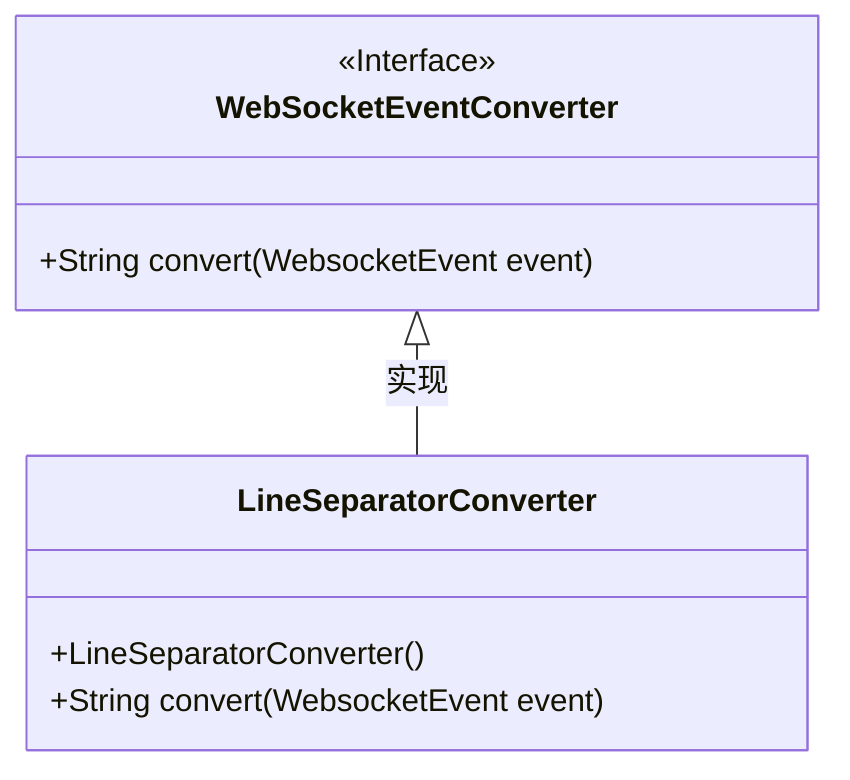
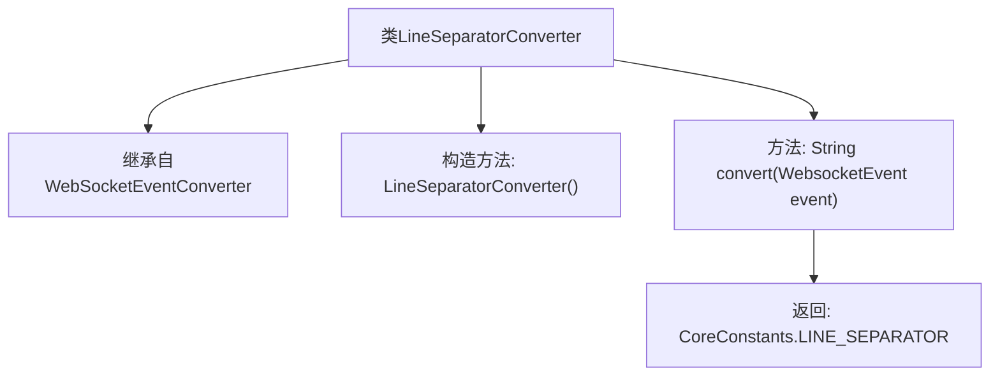

# 基础信息

|      |      |
|------|------|
| 名称 | LineSeparatorConverter |
| 编码语言 | .java |
| 代码路径 | Signal-Server/websocket-resources/src/main/java/org/whispersystems/websocket/logging/layout/converters/LineSeparatorConverter.java |
| 包名 | org.whispersystems.websocket.logging.layout.converters |
| 依赖项 | ['org.whispersystems.websocket.logging.WebsocketEvent', 'ch.qos.logback.core.CoreConstants'] |
| 概述说明 | LineSeparatorConverter继承WebSocketEventConverter，返回常量LINE_SEPARATOR。 |

# 说明

LineSeparatorConverter类继承自WebSocketEventConverter，其主要功能是返回一个常量LINE_SEPARATOR。该类通过继承关系，扩展了WebSocketEventConverter的功能，专注于处理与行分隔符相关的逻辑。

# 类列表 Class Summary

| 名称   | 类型  | 说明 |
|-------|------|-------------|
| LineSeparatorConverter | class | LineSeparatorConverter类继承WebSocketEventConverter，返回常量LINE_SEPARATOR。 |

## 类 LineSeparatorConverter

|      |      |
|------|------|
| 访问范围 | public |
| 类型 | class |
| 名称 | LineSeparatorConverter |
| 说明 | LineSeparatorConverter类继承WebSocketEventConverter，返回常量LINE_SEPARATOR。 |

### UML类图

这段代码定义了一个 `LineSeparatorConverter` 类，它继承自 `WebSocketEventConverter` 接口。`LineSeparatorConverter` 类实现了 `convert` 方法，该方法接收一个 `WebsocketEvent` 对象作为参数，并返回 `CoreConstants.LINE_SEPARATOR` 常量。`WebSocketEventConverter` 是一个接口，定义了 `convert` 方法，`LineSeparatorConverter` 类通过实现该接口来提供具体的转换逻辑。

### 内部方法调用关系图

这段代码定义了一个名为 `LineSeparatorConverter` 的类，它继承自 `WebSocketEventConverter`。该类包含一个无参构造方法和一个 `convert` 方法，该方法接收一个 `WebsocketEvent` 类型的参数，并返回 `CoreConstants.LINE_SEPARATOR`。流程图展示了类的继承关系、构造方法以及 `convert` 方法的调用和返回值。

### 字段列表 Field List

| 名称  | 类型  | 说明 |
|-------|-------|------|

### 方法列表 Method List

| 名称  | 类型  | 说明 |
|-------|-------|------|
| convert | String | 方法`convert`接收`WebsocketEvent`参数，返回`CoreConstants.LINE_SEPARATOR`。 |

