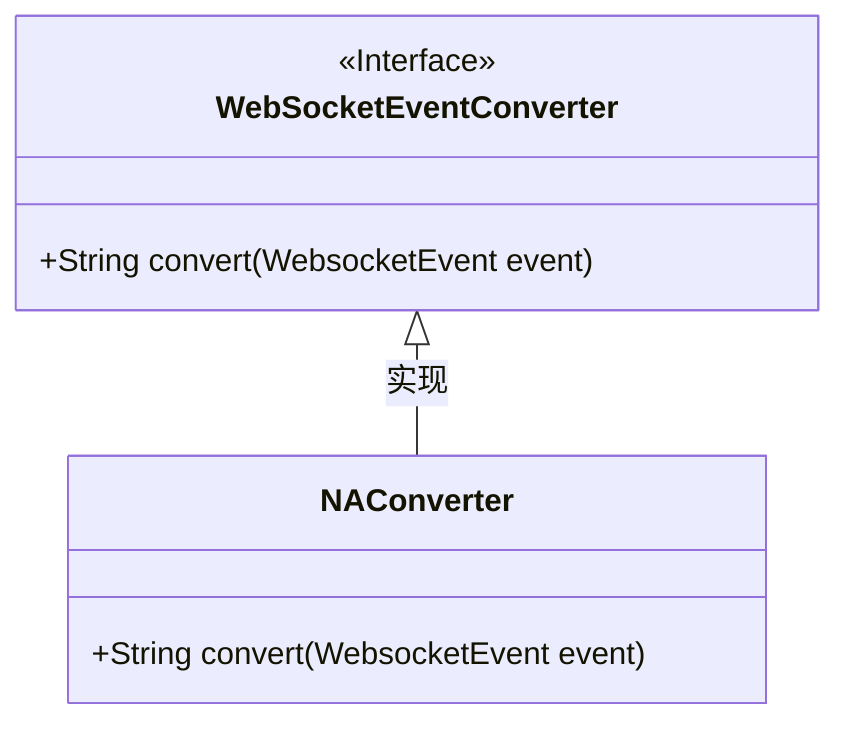
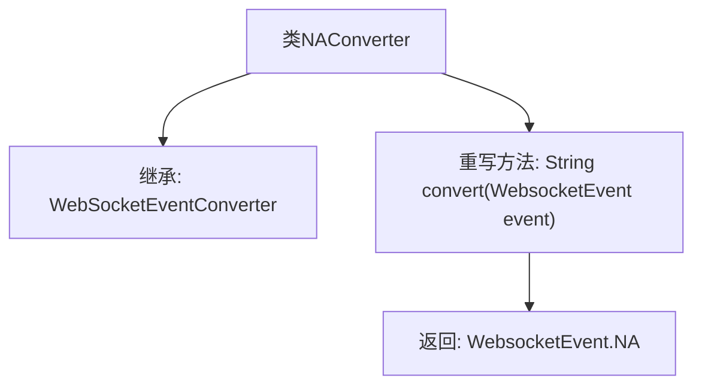

# 基础信息

|      |      |
|------|------|
| 名称 | NAConverter |
| 编码语言 | .java |
| 代码路径 | Signal-Server/websocket-resources/src/main/java/org/whispersystems/websocket/logging/layout/converters/NAConverter.java |
| 包名 | org.whispersystems.websocket.logging.layout.converters |
| 依赖项 | ['org.whispersystems.websocket.logging.WebsocketEvent'] |
| 概述说明 | NAConverter继承WebSocketEventConverter并重写convert方法，返回WebsocketEvent.NA。 |

# 说明

NAConverter类继承自WebSocketEventConverter类，并重写了其中的convert方法。该convert方法的实现直接返回WebsocketEvent.NA，表明在特定场景下，转换后的结果为未定义或未应用的WebSocket事件类型。这一设计可能用于处理某些特殊或默认的WebSocket事件，确保系统在遇到无法识别或无需处理的事件时，能够返回一个明确的状态标识。

# 类列表 Class Summary

| 名称   | 类型  | 说明 |
|-------|------|-------------|
| NAConverter | class | NAConverter类继承WebSocketEventConverter，重写convert方法返回WebsocketEvent.NA。 |

## 类 NAConverter

|      |      |
|------|------|
| 访问范围 | public |
| 类型 | class |
| 名称 | NAConverter |
| 说明 | NAConverter类继承WebSocketEventConverter，重写convert方法返回WebsocketEvent.NA。 |

### UML类图

类图描述：`NAConverter` 类继承自 `WebSocketEventConverter` 接口，并实现了 `convert` 方法。`WebSocketEventConverter` 是一个接口，定义了 `convert` 方法，而 `NAConverter` 是该接口的具体实现类，其 `convert` 方法返回 `WebsocketEvent.NA`。

### 内部方法调用关系图

这段代码定义了一个名为 `NAConverter` 的类，该类继承自 `WebSocketEventConverter` 并重写了 `convert` 方法。`convert` 方法接收一个 `WebsocketEvent` 类型的参数，并返回 `WebsocketEvent.NA`。流程图展示了类的继承关系以及方法的重写和返回逻辑，清晰地描述了代码的结构和功能。

### 字段列表 Field List

| 名称  | 类型  | 说明 |
|-------|-------|------|

### 方法列表 Method List

| 名称  | 类型  | 说明 |
|-------|-------|------|
| convert | String | 该方法将WebsocketEvent转换为字符串，默认返回NA。 |

