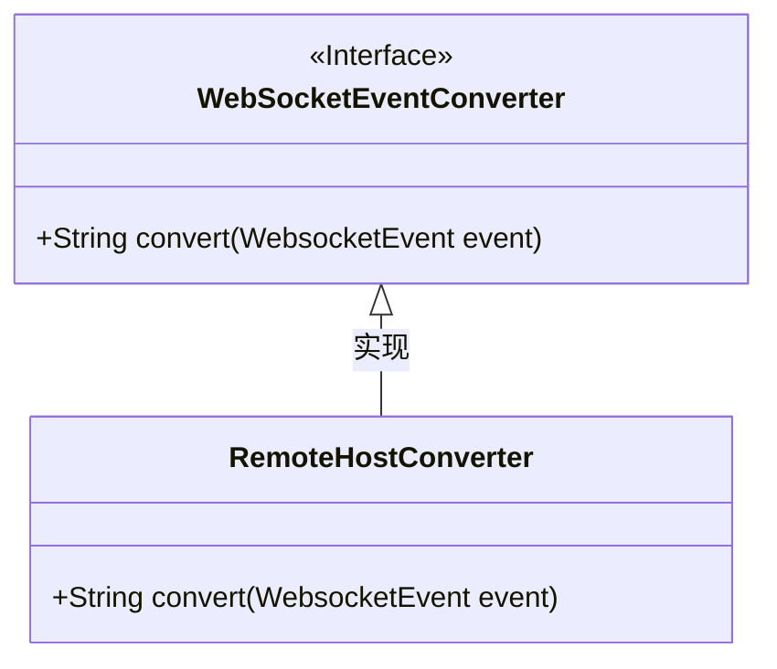
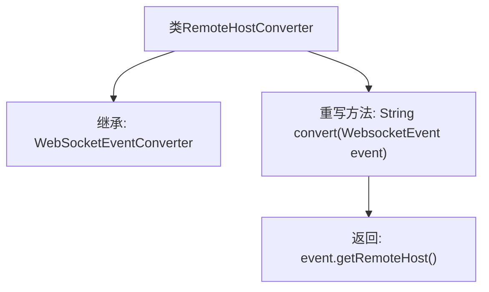

# 基础信息

|      |      |
|------|------|
| 名称 | RemoteHostConverter |
| 编码语言 | .java |
| 代码路径 | Signal-Server/websocket-resources/src/main/java/org/whispersystems/websocket/logging/layout/converters/RemoteHostConverter.java |
| 包名 | org.whispersystems.websocket.logging.layout.converters |
| 依赖项 | ['org.whispersystems.websocket.logging.WebsocketEvent'] |
| 概述说明 | RemoteHostConverter继承WebSocketEventConverter，重写convert方法获取远程主机信息。 |

# 说明

RemoteHostConverter类继承自WebSocketEventConverter类，并重写了其中的convert方法。该方法的主要功能是返回与远程主机相关的信息。通过继承和重写，RemoteHostConverter类实现了对WebSocket事件中远程主机信息的提取和转换，从而提供了特定于远程主机的数据处理能力。

# 类列表 Class Summary

| 名称   | 类型  | 说明 |
|-------|------|-------------|
| RemoteHostConverter | class | RemoteHostConverter类继承WebSocketEventConverter，重写convert方法返回远程主机信息。 |

## 类 RemoteHostConverter

|      |      |
|------|------|
| 访问范围 | public |
| 类型 | class |
| 名称 | RemoteHostConverter |
| 说明 | RemoteHostConverter类继承WebSocketEventConverter，重写convert方法返回远程主机信息。 |

### UML类图

**描述：**  
`RemoteHostConverter` 类继承自 `WebSocketEventConverter` 接口，并实现了 `convert` 方法。`WebSocketEventConverter` 是一个接口，定义了 `convert` 方法，用于将 `WebsocketEvent` 对象转换为字符串。`RemoteHostConverter` 类通过重写 `convert` 方法，返回 `WebsocketEvent` 对象的远程主机信息。类图展示了 `RemoteHostConverter` 对 `WebSocketEventConverter` 接口的实现关系。

### 内部方法调用关系图

这段代码定义了一个名为 `RemoteHostConverter` 的类，它继承自 `WebSocketEventConverter` 类。`RemoteHostConverter` 类重写了 `convert` 方法，该方法接收一个 `WebsocketEvent` 对象作为参数，并返回该对象的 `remoteHost` 属性。流程图展示了类的继承关系以及方法的重写和返回值。

### 字段列表 Field List

| 名称  | 类型  | 说明 |
|-------|-------|------|

### 方法列表 Method List

| 名称  | 类型  | 说明 |
|-------|-------|------|
| convert | String | 重写方法convert，返回WebsocketEvent的远程主机地址。 |

