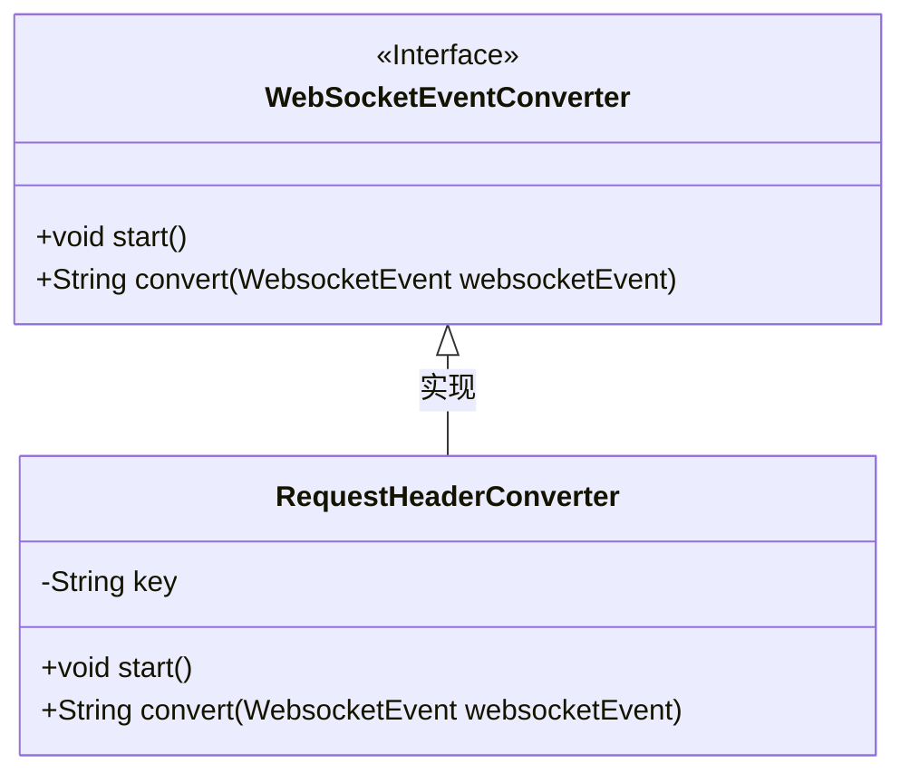
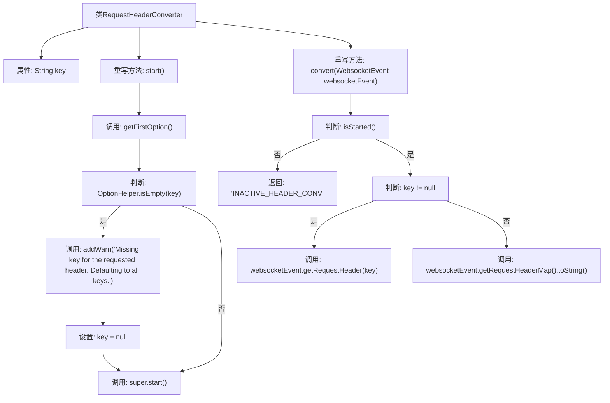

# 基础信息

|      |      |
|------|------|
| 名称 | RequestHeaderConverter |
| 编码语言 | .java |
| 代码路径 | Signal-Server/websocket-resources/src/main/java/org/whispersystems/websocket/logging/layout/converters/RequestHeaderConverter.java |
| 包名 | org.whispersystems.websocket.logging.layout.converters |
| 依赖项 | ['org.whispersystems.websocket.logging.WebsocketEvent', 'ch.qos.logback.core.util.OptionHelper'] |
| 概述说明 | RequestHeaderConverter继承WebSocketEventConverter，处理请求头转换，默认转换所有键。 |

# 说明

RequestHeaderConverter类继承自WebSocketEventConverter，专门用于处理请求头的转换任务。该类的主要功能是将请求头中的键值对进行转换。如果没有指定特定的键，默认情况下会转换所有键。

# 类列表 Class Summary

| 名称   | 类型  | 说明 |
|-------|------|-------------|
| RequestHeaderConverter | class | RequestHeaderConverter类继承WebSocketEventConverter，处理请求头转换。若无指定键，默认转换所有键。 |

## 类 RequestHeaderConverter

|      |      |
|------|------|
| 访问范围 | public |
| 类型 | class |
| 名称 | RequestHeaderConverter |
| 说明 | RequestHeaderConverter类继承WebSocketEventConverter，处理请求头转换。若无指定键，默认转换所有键。 |

### UML类图

**描述：**  
`RequestHeaderConverter` 类继承自 `WebSocketEventConverter` 接口，并实现了其 `start` 和 `convert` 方法。`RequestHeaderConverter` 类包含一个私有属性 `key`，用于存储请求头的键值。在 `start` 方法中，`key` 被初始化为第一个选项值，若为空则发出警告并使用默认值。`convert` 方法根据 `key` 的存在与否，返回特定请求头或所有请求头的字符串表示。

### 内部方法调用关系图

这段代码定义了一个`RequestHeaderConverter`类，继承自`WebSocketEventConverter`。它包含一个`key`属性和两个重写方法`start()`和`convert()`。`start()`方法初始化`key`，如果`key`为空则发出警告并设置为`null`，然后调用父类的`start()`方法。`convert()`方法根据`key`的存在与否，返回`WebsocketEvent`中的请求头信息或请求头映射的字符串表示。流程图清晰地展示了这些逻辑步骤和条件判断。

### 字段列表 Field List

| 名称  | 类型  | 说明 |
|-------|-------|------|
| key | String | 定义了一个私有字符串变量key。 |

### 方法列表 Method List

| 名称  | 类型  | 说明 |
|-------|-------|------|
| start | void | 方法start检查key是否为空，为空则警告并设为null，最后调用父类start方法。 |
| convert | String | 方法convert根据条件返回WebsocketEvent的请求头信息或状态。 |

