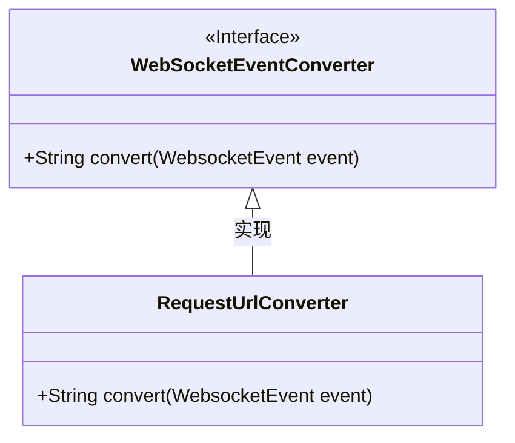
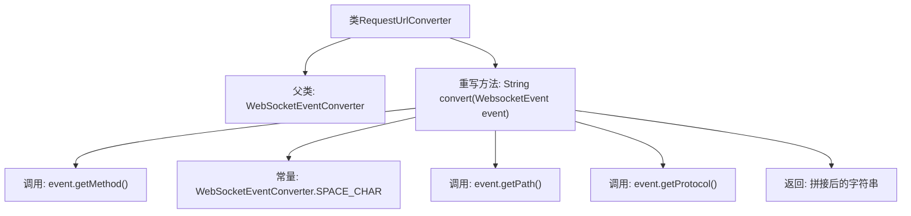

# 基础信息

|      |      |
|------|------|
| 名称 | RequestUrlConverter |
| 编码语言 | .java |
| 代码路径 | Signal-Server/websocket-resources/src/main/java/org/whispersystems/websocket/logging/layout/converters/RequestUrlConverter.java |
| 包名 | org.whispersystems.websocket.logging.layout.converters |
| 依赖项 | ['org.whispersystems.websocket.logging.WebsocketEvent'] |
| 概述说明 | RequestUrlConverter继承WebSocketEventConverter，重写convert方法，拼接事件、路径和协议。 |

# 说明

RequestUrlConverter类继承自WebSocketEventConverter，并重写了其中的convert方法。该方法的主要功能是将事件方法、路径和协议进行拼接，生成最终的请求URL。通过这种方式，RequestUrlConverter类能够有效地处理和转换WebSocket事件，确保生成的URL符合预期的格式和结构。

# 类列表 Class Summary

| 名称   | 类型  | 说明 |
|-------|------|-------------|
| RequestUrlConverter | class | RequestUrlConverter类继承WebSocketEventConverter，重写convert方法，拼接事件方法、路径和协议。 |

## 类 RequestUrlConverter

|      |      |
|------|------|
| 访问范围 | public |
| 类型 | class |
| 名称 | RequestUrlConverter |
| 说明 | RequestUrlConverter类继承WebSocketEventConverter，重写convert方法，拼接事件方法、路径和协议。 |

### UML类图

类图描述：
`RequestUrlConverter` 类继承自 `WebSocketEventConverter` 接口，并实现了 `convert` 方法。该方法将 `WebsocketEvent` 对象中的 `method`、`path` 和 `protocol` 拼接成一个字符串，中间用空格字符分隔。`WebSocketEventConverter` 是一个接口，定义了 `convert` 方法的签名，而 `RequestUrlConverter` 是其具体实现类。

### 内部方法调用关系图

这段代码定义了一个名为`RequestUrlConverter`的类，它继承自`WebSocketEventConverter`类。`RequestUrlConverter`重写了父类的`convert`方法，该方法接收一个`WebsocketEvent`对象作为参数，并返回一个拼接后的字符串。拼接的字符串包括`event.getMethod()`、`WebSocketEventConverter.SPACE_CHAR`、`event.getPath()`、`WebSocketEventConverter.SPACE_CHAR`和`event.getProtocol()`。这个方法主要用于将WebSocket事件转换为请求URL格式的字符串。

### 字段列表 Field List

| 名称  | 类型  | 说明 |
|-------|-------|------|

### 方法列表 Method List

| 名称  | 类型  | 说明 |
|-------|-------|------|
| convert | String | 重写方法将WebsocketEvent转换为包含方法、路径和协议的字符串。 |

