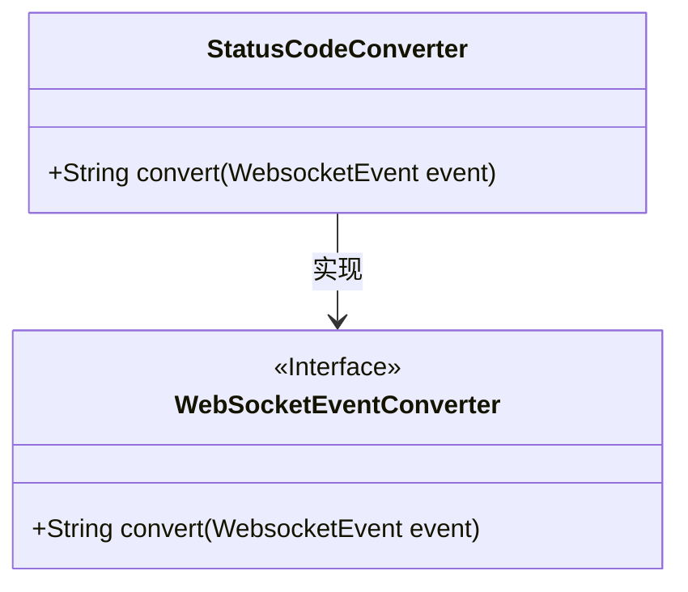
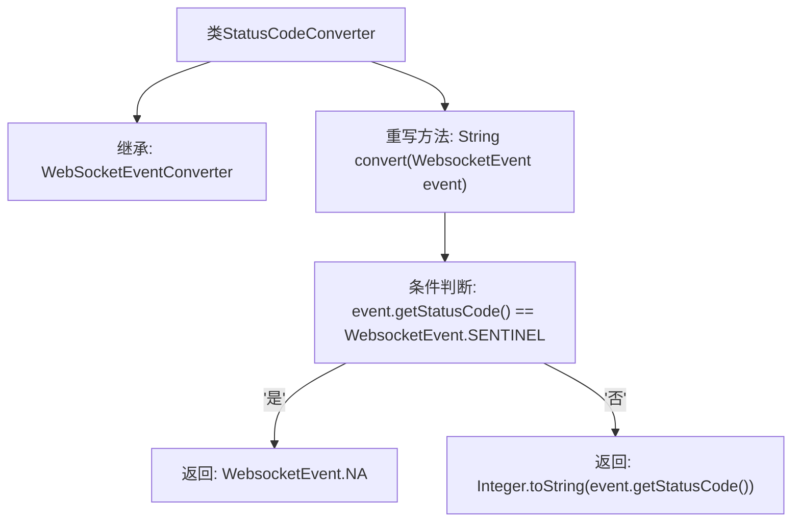

# 基础信息

|      |      |
|------|------|
| 名称 | StatusCodeConverter |
| 编码语言 | .java |
| 代码路径 | Signal-Server/websocket-resources/src/main/java/org/whispersystems/websocket/logging/layout/converters/StatusCodeConverter.java |
| 包名 | org.whispersystems.websocket.logging.layout.converters |
| 依赖项 | ['org.whispersystems.websocket.logging.WebsocketEvent'] |
| 概述说明 | StatusCodeConverter继承WebSocketEventConverter，返回NA或状态码字符串。 |

# 说明

StatusCodeConverter类继承自WebSocketEventConverter，其主要功能是根据事件的状态码进行处理。如果状态码符合特定条件，该类会返回字符串"NA"；否则，它会将状态码转换为字符串形式返回。这个类的设计旨在简化状态码的处理逻辑，确保在不同情况下能够提供一致的输出。

# 类列表 Class Summary

| 名称   | 类型  | 说明 |
|-------|------|-------------|
| StatusCodeConverter | class | StatusCodeConverter类继承WebSocketEventConverter，根据事件状态码返回NA或状态码字符串。 |

## 类 StatusCodeConverter

|      |      |
|------|------|
| 访问范围 | public |
| 类型 | class |
| 名称 | StatusCodeConverter |
| 说明 | StatusCodeConverter类继承WebSocketEventConverter，根据事件状态码返回NA或状态码字符串。 |

### UML类图

这段代码定义了一个 `StatusCodeConverter` 类，它实现了 `WebSocketEventConverter` 接口。`StatusCodeConverter` 类中的 `convert` 方法根据 `WebsocketEvent` 对象的状态码进行转换：如果状态码等于 `WebsocketEvent.SENTINEL`，则返回 `WebsocketEvent.NA`；否则，将状态码转换为字符串返回。类图清晰地展示了 `StatusCodeConverter` 类与 `WebSocketEventConverter` 接口之间的实现关系。

### 内部方法调用关系图

这段代码定义了一个名为 `StatusCodeConverter` 的类，该类继承自 `WebSocketEventConverter`，并重写了 `convert` 方法。`convert` 方法接收一个 `WebsocketEvent` 对象作为参数，根据事件的状态码是否等于 `WebsocketEvent.SENTINEL` 来决定返回 `WebsocketEvent.NA` 还是将状态码转换为字符串返回。流程图展示了类的继承关系和方法的逻辑流程。

### 字段列表 Field List

| 名称  | 类型  | 说明 |
|-------|-------|------|

### 方法列表 Method List

| 名称  | 类型  | 说明 |
|-------|-------|------|
| convert | String | 重写convert方法，根据事件状态码返回字符串或特定值。 |

