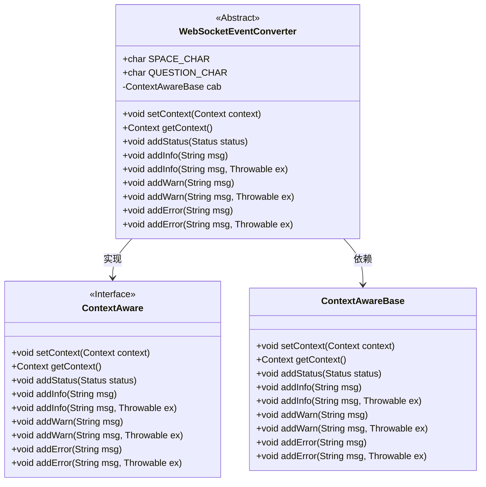
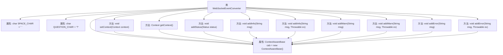

# 基础信息

|      |      |
|------|------|
| 名称 | WebSocketEventConverter |
| 编码语言 | .java |
| 代码路径 | Signal-Server/websocket-resources/src/main/java/org/whispersystems/websocket/logging/layout/converters/WebSocketEventConverter.java |
| 包名 | org.whispersystems.websocket.logging.layout.converters |
| 依赖项 | ['org.whispersystems.websocket.logging.WebsocketEvent', 'ch.qos.logback.core.Context', 'ch.qos.logback.core.pattern.DynamicConverter', 'ch.qos.logback.core.spi.ContextAware', 'ch.qos.logback.core.spi.ContextAwareBase', 'ch.qos.logback.core.status.Status'] |
| 概述说明 | WebSocketEventConverter继承DynamicConverter，实现ContextAware，处理上下文和日志。 |

# 说明

WebSocketEventConverter类继承自DynamicConverter，并实现了ContextAware接口。通过ContextAwareBase类，它能够处理上下文信息和日志记录。这一设计使得WebSocketEventConverter在动态转换过程中能够有效地管理和利用上下文数据，同时确保日志记录的完整性和可追溯性。

# 类列表 Class Summary

| 名称   | 类型  | 说明 |
|-------|------|-------------|
| WebSocketEventConverter | class | WebSocketEventConverter继承DynamicConverter，实现ContextAware，通过ContextAwareBase处理上下文和日志。 |

## 类 WebSocketEventConverter

|      |      |
|------|------|
| 访问范围 | public abstract |
| 类型 | class |
| 名称 | WebSocketEventConverter |
| 说明 | WebSocketEventConverter继承DynamicConverter，实现ContextAware，通过ContextAwareBase处理上下文和日志。 |

### UML类图

这段代码描述了一个抽象类 `WebSocketEventConverter`，它继承了 `DynamicConverter<WebsocketEvent>` 并实现了 `ContextAware` 接口。`WebSocketEventConverter` 类中包含了多个方法，这些方法通过 `ContextAwareBase` 类的实例 `cab` 来执行具体的操作。`ContextAware` 是一个接口，定义了与上下文相关的操作，而 `ContextAwareBase` 则是一个具体的类，实现了这些操作。`WebSocketEventConverter` 类通过实现 `ContextAware` 接口并依赖 `ContextAwareBase` 类来完成其功能。

### 内部方法调用关系图

该流程图展示了`WebSocketEventConverter`类的结构及其方法调用关系。`WebSocketEventConverter`类继承自`DynamicConverter`并实现了`ContextAware`接口，包含多个方法用于设置上下文、获取上下文以及添加状态、信息、警告和错误日志。所有方法都通过`ContextAwareBase`对象`cab`来实现具体功能，确保了代码的模块化和可维护性。

### 字段列表 Field List

| 名称  | 类型  | 说明 |
|-------|-------|------|
| cab = new ContextAwareBase() | ContextAwareBase | 创建ContextAwareBase实例cab。 |
| SPACE_CHAR = ' ' | char | 定义了一个公共静态常量字符SPACE_CHAR，值为空格。 |
| QUESTION_CHAR = '?' | char | 定义了一个不可变的静态字符常量，其值为问号。 |

### 方法列表 Method List

| 名称  | 类型  | 说明 |
|-------|-------|------|
| getContext | Context | 重写getContext方法，返回cab的Context对象。 |
| setContext | void | 重写setContext方法，调用cab对象的setContext方法。 |
| addError | void | 重写addError方法，调用cab对象的addError方法处理错误信息。 |
| addError | void | 重写addError方法，调用cab.addError传递错误信息。 |
| addInfo | void | 重写addInfo方法，调用cab对象的addInfo方法传递消息。 |
| addInfo | void | 重写addInfo方法，调用cab的addInfo处理消息和异常。 |
| addStatus | void | 重写addStatus方法，调用cab对象的addStatus方法添加状态。 |
| addWarn | void | 重写addWarn方法，调用cab对象的addWarn方法。 |
| addWarn | void | 重写addWarn方法，调用cab对象的addWarn方法处理警告信息。 |

