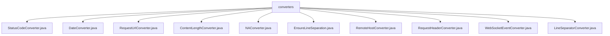

# 基础信息

|      |      |
|------|------|
| 名称 | converters |
| 编码语言 | .java |
| 代码路径 | Signal-Server/websocket-resources/src/main/java/org/whispersystems/websocket/logging/layout/converters |
| 包名 | Signal-Server.websocket-resources.src.main.java.org.whispersystems.websocket.logging.layout.converters |
| 概述说明 | StatusCodeConverter处理状态码，DateConverter格式化时间戳，RequestUrlConverter生成请求URL，ContentLengthConverter处理内容长度，NAConverter返回未定义事件，EnsureLineSeparation分行显示事件，RemoteHostConverter提取远程主机信息，RequestHeaderConverter转换请求头，WebSocketEventConverter管理上下文，LineSeparatorConverter处理行分隔符。 |

# 说明

## 概述
该代码模块是一个用于处理WebSocket事件的日志记录和转换的工具集。模块中的各个类继承自`WebSocketEventConverter`，并分别实现了对WebSocket事件中不同属性的转换和处理功能。这些转换器类主要用于格式化、提取和转换WebSocket事件中的状态码、日期、请求URL、内容长度、远程主机信息、请求头等内容，确保日志记录的一致性和可读性。此外，模块还包含了一些辅助类，如`EnsureLineSeparation`和`LineSeparatorConverter`，用于提升事件信息的结构化展示和可读性。

## 主要业务场景
1. **状态码处理**：`StatusCodeConverter`类根据事件的状态码进行处理，符合特定条件时返回"NA"，否则将状态码转换为字符串形式返回。
2. **日期格式化**：`DateConverter`类负责初始化日期格式并处理时区信息，确保时间戳以统一的日期格式呈现。
3. **请求URL生成**：`RequestUrlConverter`类将事件方法、路径和协议进行拼接，生成最终的请求URL。
4. **内容长度处理**：`ContentLengthConverter`类根据事件内容的长度返回相应的字符串，提供灵活且准确的响应处理。
5. **特殊事件处理**：`NAConverter`类在特定场景下返回`WebsocketEvent.NA`，用于处理无法识别或无需处理的事件。
6. **事件分行展示**：`EnsureLineSeparation`类确保WebSocket事件在显示时能够分行呈现，提升事件信息的可读性。
7. **远程主机信息提取**：`RemoteHostConverter`类提取和转换WebSocket事件中与远程主机相关的信息。
8. **请求头转换**：`RequestHeaderConverter`类将请求头中的键值对进行转换，支持指定特定键或默认转换所有键。
9. **行分隔符处理**：`LineSeparatorConverter`类返回常量`LINE_SEPARATOR`，用于处理与行分隔符相关的逻辑。

这些业务场景共同构成了一个完整的WebSocket事件日志记录和转换系统，确保在不同情况下能够提供一致、准确且易于理解的日志信息。

### 包内部结构视图

该流程图展示了 `converters` 文件夹下的多个转换器类文件的层级关系。`converters` 作为父节点，包含了多个具体的转换器类文件，如 `StatusCodeConverter.java`、`DateConverter.java` 等。这些转换器类文件用于处理不同类型的日志数据转换任务，每个文件都代表一个独立的功能模块。

# 文件列表 File List

| 名称   | 类型  | 说明 |
|-------|------|-------------|
| [EnsureLineSeparation.java](EnsureLineSeparation.md) | file | EnsureLineSeparation类实现WebsocketEvent事件分行显示。 |
| [RequestUrlConverter.java](RequestUrlConverter.md) | file | RequestUrlConverter继承WebSocketEventConverter，重写convert方法，拼接事件、路径和协议。 |
| [LineSeparatorConverter.java](LineSeparatorConverter.md) | file | LineSeparatorConverter继承WebSocketEventConverter，返回常量LINE_SEPARATOR。 |
| [WebSocketEventConverter.java](WebSocketEventConverter.md) | file | WebSocketEventConverter继承DynamicConverter，实现ContextAware，处理上下文和日志。 |
| [RequestHeaderConverter.java](RequestHeaderConverter.md) | file | RequestHeaderConverter继承WebSocketEventConverter，处理请求头转换，默认转换所有键。 |
| [RemoteHostConverter.java](RemoteHostConverter.md) | file | RemoteHostConverter继承WebSocketEventConverter，重写convert方法获取远程主机信息。 |
| [NAConverter.java](NAConverter.md) | file | NAConverter继承WebSocketEventConverter并重写convert方法，返回WebsocketEvent.NA。 |
| [ContentLengthConverter.java](ContentLengthConverter.md) | file | ContentLengthConverter继承WebSocketEventConverter，按事件长度返回字符串。 |
| [DateConverter.java](DateConverter.md) | file | DateConverter继承WebSocketEventConverter，初始化日期格式，处理时区并格式化时间戳。 |
| [StatusCodeConverter.java](StatusCodeConverter.md) | file | StatusCodeConverter继承WebSocketEventConverter，返回NA或状态码字符串。 |

