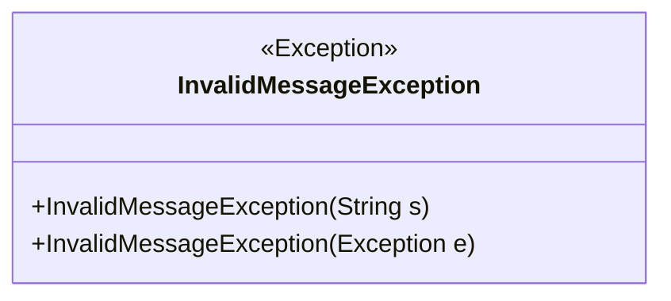
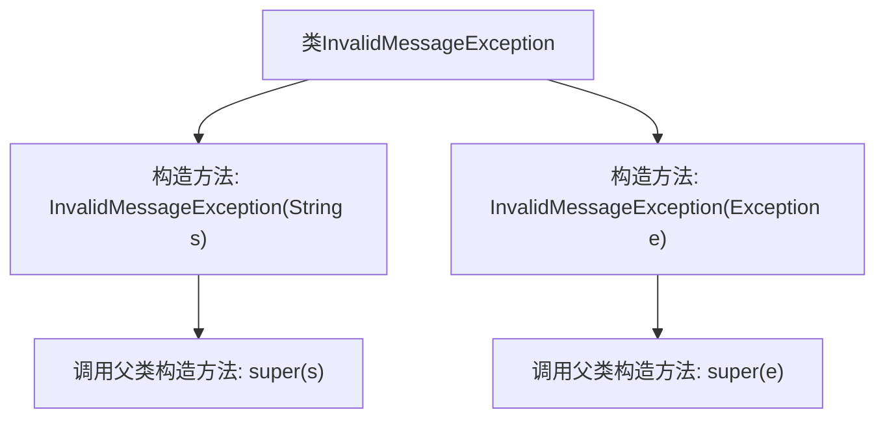

# 基础信息

|      |      |
|------|------|
| 名称 | InvalidMessageException |
| 编码语言 | .java |
| 代码路径 | Signal-Server/websocket-resources/src/main/java/org/whispersystems/websocket/messages/InvalidMessageException.java |
| 包名 | org.whispersystems.websocket.messages |
| 依赖项 | [] |
| 概述说明 | InvalidMessageException继承Exception，提供两种构造方法。 |

# 说明

InvalidMessageException类继承自Exception类，提供了两种构造方法。第一种构造方法无参数，用于创建默认的异常对象。第二种构造方法接受一个字符串参数，用于传递异常信息，并在创建异常对象时设置该信息。这两种构造方法使得InvalidMessageException类能够灵活地处理不同的异常场景，既可以使用默认信息，也可以自定义异常描述。

# 类列表 Class Summary

| 名称   | 类型  | 说明 |
|-------|------|-------------|
| InvalidMessageException | class | InvalidMessageException类继承Exception，提供两种构造方法。 |

## 类 InvalidMessageException

|      |      |
|------|------|
| 访问范围 | public |
| 类型 | class |
| 名称 | InvalidMessageException |
| 说明 | InvalidMessageException类继承Exception，提供两种构造方法。 |

### UML类图

这段代码定义了一个名为 `InvalidMessageException` 的自定义异常类，它继承自 `Exception` 类。该类提供了两个构造函数：一个接受字符串参数，用于传递异常信息；另一个接受 `Exception` 类型的参数，用于包装另一个异常。这个自定义异常类通常用于在消息处理过程中捕获和传递特定的错误情况。

### 内部方法调用关系图

这段代码定义了一个名为 `InvalidMessageException` 的异常类，继承自 `Exception`。它包含两个构造方法：一个接受字符串参数 `s`，另一个接受异常对象 `e`。每个构造方法都通过 `super` 调用了父类 `Exception` 的相应构造方法，分别传递字符串或异常对象。这个类用于在消息无效时抛出异常，便于在程序中处理特定的错误情况。

### 字段列表 Field List

| 名称  | 类型  | 说明 |
|-------|-------|------|

### 方法列表 Method List

| 名称  | 类型  | 说明 |
|-------|-------|------|

