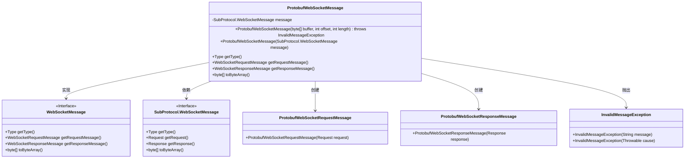
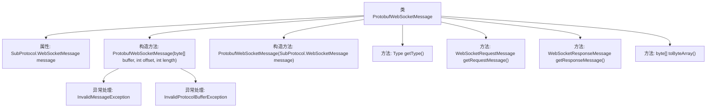

# 基础信息

|      |      |
|------|------|
| 名称 | ProtobufWebSocketMessage |
| 编码语言 | .java |
| 代码路径 | Signal-Server/websocket-resources/src/main/java/org/whispersystems/websocket/messages/protobuf/ProtobufWebSocketMessage.java |
| 包名 | org.whispersystems.websocket.messages.protobuf |
| 依赖项 | ['com.google.protobuf.ByteString', 'com.google.protobuf.InvalidProtocolBufferException', 'org.whispersystems.websocket.messages.InvalidMessageException', 'org.whispersystems.websocket.messages.WebSocketMessage', 'org.whispersystems.websocket.messages.WebSocketRequestMessage', 'org.whispersystems.websocket.messages.WebSocketResponseMessage'] |
| 概述说明 | ProtobufWebSocketMessage类处理WebSocket消息，验证请求响应，支持类型判断和消息转换。 |

# 说明

ProtobufWebSocketMessage类专门用于处理WebSocket消息，具备验证请求和响应属性的功能，支持对消息类型进行判断，并能实现消息格式的转换。该类确保了消息处理的准确性和兼容性，适用于需要高效处理WebSocket通信的场景。

# 类列表 Class Summary

| 名称   | 类型  | 说明 |
|-------|------|-------------|
| ProtobufWebSocketMessage | class | ProtobufWebSocketMessage类处理WebSocket消息，验证请求和响应属性，支持类型判断和消息转换。 |

## 类 ProtobufWebSocketMessage

|      |      |
|------|------|
| 访问范围 | public |
| 类型 | class |
| 名称 | ProtobufWebSocketMessage |
| 说明 | ProtobufWebSocketMessage类处理WebSocket消息，验证请求和响应属性，支持类型判断和消息转换。 |

### UML类图

这段代码定义了一个`ProtobufWebSocketMessage`类，实现了`WebSocketMessage`接口，用于处理通过WebSocket传输的Protobuf格式的消息。该类通过构造函数解析字节数组并验证消息的完整性，同时提供了获取请求和响应消息的方法。它还处理了消息类型的判断，并在消息不完整时抛出`InvalidMessageException`异常。

### 内部方法调用关系图

这段代码定义了一个`ProtobufWebSocketMessage`类，用于处理WebSocket消息的序列化和反序列化。类中包含两个构造方法，分别用于从字节数组和`SubProtocol.WebSocketMessage`对象初始化消息。`getType`方法用于确定消息类型，`getRequestMessage`和`getResponseMessage`方法分别返回请求和响应消息对象。`toByteArray`方法将消息转换为字节数组。代码还处理了`InvalidMessageException`和`InvalidProtocolBufferException`异常，确保消息的完整性和正确性。

### 字段列表 Field List

| 名称  | 类型  | 说明 |
|-------|-------|------|
| message | SubProtocol.WebSocketMessage | 私有且不可变的WebSocket消息对象。 |

### 方法列表 Method List

| 名称  | 类型  | 说明 |
|-------|-------|------|
| toByteArray | byte[] | 重写toByteArray方法，返回message的字节数组。 |
| getResponseMessage | WebSocketResponseMessage | 重写方法返回ProtobufWebSocketResponseMessage实例。 |
| getRequestMessage | WebSocketRequestMessage | 重写方法，返回ProtobufWebSocketRequestMessage实例。 |
| getType | Type | 根据消息类型和内容返回REQUEST_MESSAGE、RESPONSE_MESSAGE或UNKNOWN_MESSAGE。 |

