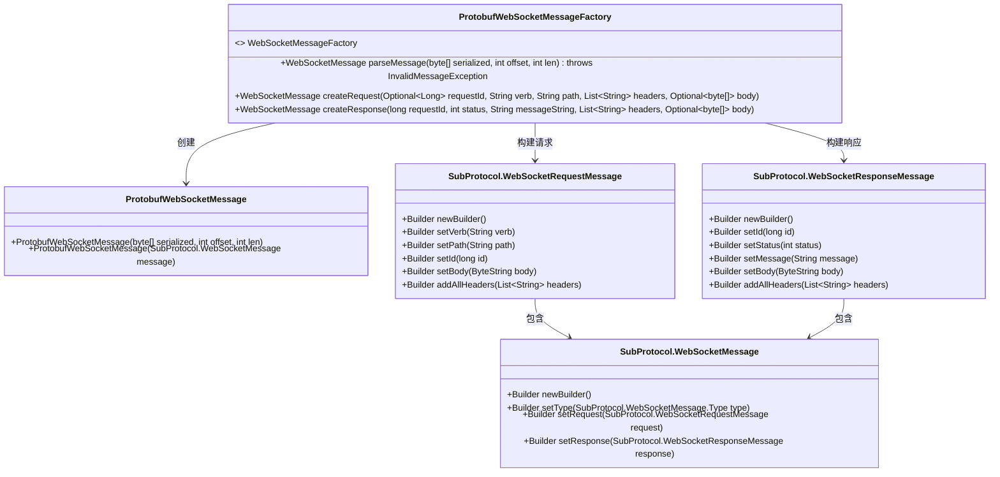
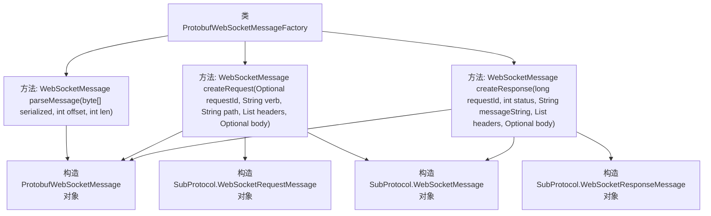

# 基础信息

|      |      |
|------|------|
| 名称 | ProtobufWebSocketMessageFactory |
| 编码语言 | .java |
| 代码路径 | Signal-Server/websocket-resources/src/main/java/org/whispersystems/websocket/messages/protobuf/ProtobufWebSocketMessageFactory.java |
| 包名 | org.whispersystems.websocket.messages.protobuf |
| 依赖项 | ['com.google.protobuf.ByteString', 'org.whispersystems.websocket.messages.InvalidMessageException', 'org.whispersystems.websocket.messages.WebSocketMessage', 'org.whispersystems.websocket.messages.WebSocketMessageFactory', 'java.util.List', 'java.util.Optional'] |
| 概述说明 | ProtobufWebSocketMessageFactory实现WebSocket消息的解析与创建，支持请求和响应。 |

# 说明

ProtobufWebSocketMessageFactory是一个用于实现WebSocket消息解析与创建的工厂类。它支持处理WebSocket请求和响应消息，能够将Protobuf格式的数据进行解析，并生成相应的WebSocket消息。该工厂类的主要功能是简化WebSocket通信中消息的处理流程，确保消息能够高效、准确地被解析和创建，从而提升系统的整体性能和可靠性。

# 类列表 Class Summary

| 名称   | 类型  | 说明 |
|-------|------|-------------|
| ProtobufWebSocketMessageFactory | class | ProtobufWebSocketMessageFactory实现WebSocket消息解析与创建，支持请求和响应。 |

## 类 ProtobufWebSocketMessageFactory

|      |      |
|------|------|
| 访问范围 | public |
| 类型 | class |
| 名称 | ProtobufWebSocketMessageFactory |
| 说明 | ProtobufWebSocketMessageFactory实现WebSocket消息解析与创建，支持请求和响应。 |

### UML类图

### 描述
`ProtobufWebSocketMessageFactory` 是一个实现了 `WebSocketMessageFactory` 接口的类，负责解析和创建基于 Protobuf 协议的 WebSocket 消息。它提供了三个主要方法：`parseMessage` 用于解析字节数组为 `WebSocketMessage`，`createRequest` 用于创建请求消息，`createResponse` 用于创建响应消息。这些方法通过构建 `SubProtocol.WebSocketRequestMessage` 和 `SubProtocol.WebSocketResponseMessage` 对象，最终生成 `ProtobufWebSocketMessage` 实例。整个流程展示了工厂模式在消息处理中的应用。

### 内部方法调用关系图

这段代码定义了一个`ProtobufWebSocketMessageFactory`类，该类实现了`WebSocketMessageFactory`接口。它提供了三个主要方法：`parseMessage`、`createRequest`和`createResponse`。`parseMessage`方法用于解析字节数组并生成`ProtobufWebSocketMessage`对象。`createRequest`方法用于创建请求消息，构建`SubProtocol.WebSocketRequestMessage`对象，并将其封装到`ProtobufWebSocketMessage`中。`createResponse`方法用于创建响应消息，构建`SubProtocol.WebSocketResponseMessage`对象，并将其封装到`ProtobufWebSocketMessage`中。这些方法都涉及到对`SubProtocol`消息的构建和封装，最终返回`ProtobufWebSocketMessage`对象。

### 字段列表 Field List

| 名称  | 类型  | 说明 |
|-------|-------|------|

### 方法列表 Method List

| 名称  | 类型  | 说明 |
|-------|-------|------|
| parseMessage | WebSocketMessage | 重写parseMessage方法，将字节数组解析为ProtobufWebSocketMessage对象。 |
| createRequest | WebSocketMessage | 创建WebSocket请求消息，包含请求ID、动词、路径、头部和可选主体。 |
| createResponse | WebSocketMessage | 创建WebSocket响应消息，包含ID、状态、消息、头部和可选正文。 |

