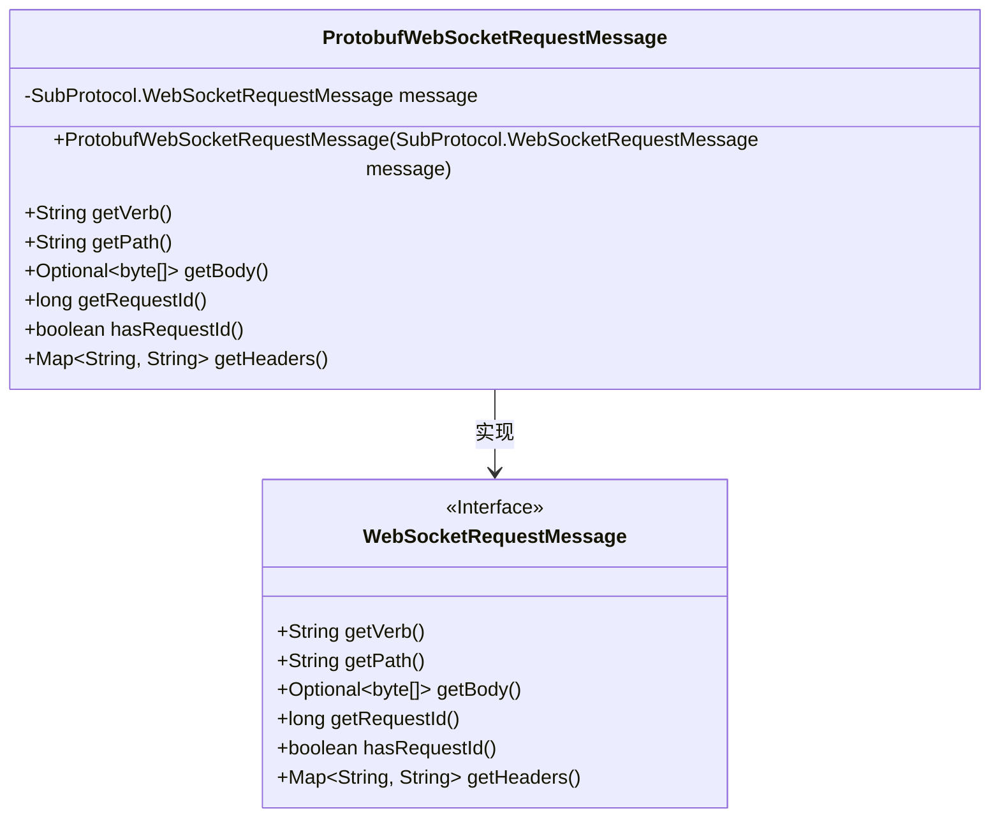
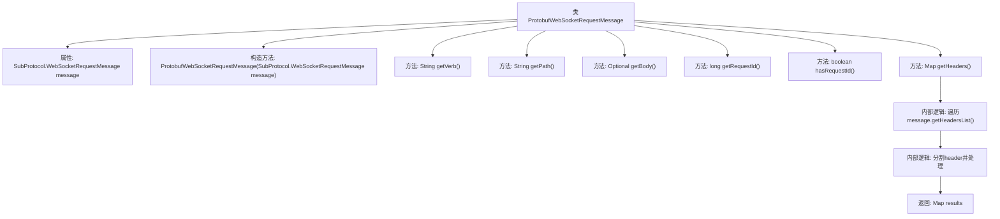

# 基础信息

|      |      |
|------|------|
| 名称 | ProtobufWebSocketRequestMessage |
| 编码语言 | .java |
| 代码路径 | Signal-Server/websocket-resources/src/main/java/org/whispersystems/websocket/messages/protobuf/ProtobufWebSocketRequestMessage.java |
| 包名 | org.whispersystems.websocket.messages.protobuf |
| 依赖项 | ['org.whispersystems.websocket.messages.WebSocketRequestMessage', 'java.util.HashMap', 'java.util.Map', 'java.util.Optional'] |
| 概述说明 | ProtobufWebSocketRequestMessage封装请求方法、路径、体、ID和头信息。 |

# 说明

ProtobufWebSocketRequestMessage实现了WebSocketRequestMessage接口，用于封装WebSocket请求的相关信息。该消息类包含了请求方法、路径、请求体、唯一标识ID以及头信息等关键数据。通过这种方式，可以有效地组织和传递WebSocket请求的所有必要信息，确保请求的完整性和可追溯性。

# 类列表 Class Summary

| 名称   | 类型  | 说明 |
|-------|------|-------------|
| ProtobufWebSocketRequestMessage | class | ProtobufWebSocketRequestMessage实现WebSocketRequestMessage，封装请求方法、路径、体、ID和头信息。 |

## 类 ProtobufWebSocketRequestMessage

|      |      |
|------|------|
| 访问范围 | public |
| 类型 | class |
| 名称 | ProtobufWebSocketRequestMessage |
| 说明 | ProtobufWebSocketRequestMessage实现WebSocketRequestMessage，封装请求方法、路径、体、ID和头信息。 |

### UML类图

这段代码定义了一个`ProtobufWebSocketRequestMessage`类，该类实现了`WebSocketRequestMessage`接口。`ProtobufWebSocketRequestMessage`类通过封装`SubProtocol.WebSocketRequestMessage`对象，提供了获取HTTP动词、路径、请求体、请求ID和请求头的方法。代码中使用了泛型`Optional`和`Map`来处理可能为空的值和键值对集合。通过实现接口，该类能够提供统一的WebSocket请求消息处理方式。

### 内部方法调用关系图

**描述：**  
`ProtobufWebSocketRequestMessage`类实现了`WebSocketRequestMessage`接口，用于处理WebSocket请求消息。它包含一个`SubProtocol.WebSocketRequestMessage`类型的属性`message`，并通过构造方法进行初始化。类中提供了多个方法，如`getVerb`、`getPath`、`getBody`、`getRequestId`、`hasRequestId`和`getHeaders`，用于获取请求的不同部分。其中，`getHeaders`方法遍历`message`的头部列表，对每个头部进行分割和处理，最终返回一个包含处理结果的`Map<String, String>`。

### 字段列表 Field List

| 名称  | 类型  | 说明 |
|-------|-------|------|
| message | SubProtocol.WebSocketRequestMessage | 私有变量message存储WebSocket请求消息。 |

### 方法列表 Method List

| 名称  | 类型  | 说明 |
|-------|-------|------|
| getBody | Optional<byte[]> | 重写getBody方法，返回消息体的字节数组或空Optional。 |
| getPath | String | 重写getPath方法，返回message的路径。 |
| getHeaders | Map<String, String> | 重写方法解析消息头并返回小写键值对。 |
| getRequestId | long | 重写getRequestId方法，返回message对象的ID。 |
| getVerb | String | 重写getVerb方法，返回message对象的verb属性。 |
| hasRequestId | boolean | 方法重写，检查消息是否包含ID。 |

