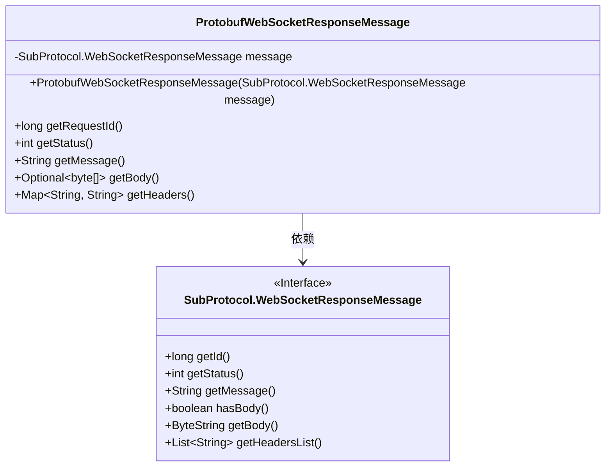
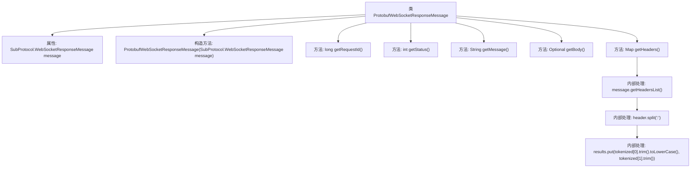

# 基础信息

|      |      |
|------|------|
| 名称 | ProtobufWebSocketResponseMessage |
| 编码语言 | .java |
| 代码路径 | Signal-Server/websocket-resources/src/main/java/org/whispersystems/websocket/messages/protobuf/ProtobufWebSocketResponseMessage.java |
| 包名 | org.whispersystems.websocket.messages.protobuf |
| 依赖项 | ['org.whispersystems.websocket.messages.WebSocketResponseMessage', 'java.util.HashMap', 'java.util.Map', 'java.util.Optional'] |
| 概述说明 | ProtobufWebSocketResponseMessage类封装WebSocket响应消息，包含请求ID、状态、消息、正文和头部信息。 |

# 说明

ProtobufWebSocketResponseMessage类实现了WebSocket响应消息接口，负责封装与WebSocket响应相关的关键信息。该类包含了请求ID、状态、消息、正文和头部信息等属性，确保响应消息的完整性和可管理性。通过这些封装，开发者可以方便地处理和传递WebSocket响应数据，提高代码的可读性和维护性。

# 类列表 Class Summary

| 名称   | 类型  | 说明 |
|-------|------|-------------|
| ProtobufWebSocketResponseMessage | class | ProtobufWebSocketResponseMessage类实现WebSocket响应消息接口，封装请求ID、状态、消息、正文和头部信息。 |

## 类 ProtobufWebSocketResponseMessage

|      |      |
|------|------|
| 访问范围 | public |
| 类型 | class |
| 名称 | ProtobufWebSocketResponseMessage |
| 说明 | ProtobufWebSocketResponseMessage类实现WebSocket响应消息接口，封装请求ID、状态、消息、正文和头部信息。 |

### UML类图

**描述：**  
`ProtobufWebSocketResponseMessage` 类实现了 `WebSocketResponseMessage` 接口，用于处理 WebSocket 响应消息。它通过 `SubProtocol.WebSocketResponseMessage` 对象获取请求的详细信息，包括请求ID、状态、消息内容、消息体以及头部信息。`getBody` 方法返回一个 `Optional<byte[]>`，如果消息体存在则返回字节数组，否则返回空。`getHeaders` 方法将头部信息解析为键值对并返回一个 `Map<String, String>`。该类依赖于 `SubProtocol.WebSocketResponseMessage` 接口来获取消息的具体内容。

### 内部方法调用关系图

这段代码定义了一个`ProtobufWebSocketResponseMessage`类，用于处理WebSocket响应消息。类中包含一个构造方法和多个重写方法，用于获取请求ID、状态、消息内容、消息体以及消息头。`getHeaders`方法通过解析消息头列表，将键值对存储在一个`Map`中返回。流程图展示了类的结构及其内部方法的调用关系。

### 字段列表 Field List

| 名称  | 类型  | 说明 |
|-------|-------|------|
| message | SubProtocol.WebSocketResponseMessage | 私有常量WebSocket响应消息对象。 |

### 方法列表 Method List

| 名称  | 类型  | 说明 |
|-------|-------|------|
| getStatus | int | 重写getStatus方法，返回message的状态值。 |
| getMessage | String | 重写getMessage方法，返回message对象的getMessage结果。 |
| getHeaders | Map<String, String> | 重写getHeaders方法，解析消息头并返回键值对映射。 |
| getBody | Optional<byte[]> | 检查消息体并返回字节数组或空值。 |
| getRequestId | long | 重写getRequestId方法，返回message的ID。 |

