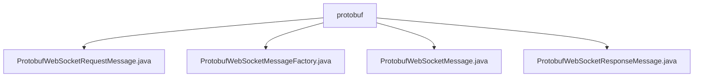

# 基础信息

|      |      |
|------|------|
| 名称 | protobuf |
| 编码语言 | .java |
| 代码路径 | Signal-Server/websocket-resources/src/main/java/org/whispersystems/websocket/messages/protobuf |
| 包名 | Signal-Server.websocket-resources.src.main.java.org.whispersystems.websocket.messages.protobuf |
| 概述说明 | ProtobufWebSocket类封装请求响应信息，工厂类解析创建消息，确保通信高效可靠。 |

# 说明

## 概述
该代码模块主要围绕WebSocket通信中的消息处理展开，提供了基于Protobuf格式的WebSocket消息封装、解析与创建功能。模块通过多个核心类实现了对WebSocket请求和响应消息的高效管理，确保消息的完整性、可追溯性和兼容性。主要功能包括WebSocket消息的封装、消息类型的判断、格式转换以及工厂模式下的消息解析与创建。这些类共同协作，简化了WebSocket通信中的消息处理流程，提升了系统的性能和可靠性。

## 主要业务场景
1. **WebSocket请求消息封装**：通过`ProtobufWebSocketRequestMessage`类，开发者可以封装WebSocket请求的相关信息，包括请求方法、路径、请求体、唯一标识ID以及头信息等。这种封装确保了请求数据的完整性和可追溯性，适用于需要发送WebSocket请求的场景。
2. **WebSocket消息解析与创建**：`ProtobufWebSocketMessageFactory`工厂类提供了对Protobuf格式的WebSocket消息的解析与创建功能。它简化了消息处理的流程，适用于需要高效解析和生成WebSocket消息的场景。
3. **WebSocket消息处理与验证**：`ProtobufWebSocketMessage`类负责处理WebSocket消息，支持对消息类型的判断和格式的转换。它确保了消息处理的准确性和兼容性，适用于需要验证和处理WebSocket消息的场景。
4. **WebSocket响应消息封装**：`ProtobufWebSocketResponseMessage`类封装了WebSocket响应的关键信息，包括请求ID、状态、消息、正文和头部信息等。这种封装提高了响应数据的可管理性和代码的可读性，适用于需要处理和传递WebSocket响应数据的场景。

这些业务场景共同构成了一个完整的WebSocket消息处理模块，适用于需要高效、可靠地处理WebSocket通信的系统。

### 包内部结构视图

该流程图展示了`protobuf`目录下的四个Java文件之间的层级关系。`protobuf`作为根节点，包含了四个子节点，分别对应不同的WebSocket消息处理类。这些类主要用于处理WebSocket请求和响应的Protobuf消息格式，展示了它们在项目中的组织结构和依赖关系。

# 文件列表 File List

| 名称   | 类型  | 说明 |
|-------|------|-------------|
| [ProtobufWebSocketMessageFactory.java](ProtobufWebSocketMessageFactory.md) | file | ProtobufWebSocketMessageFactory实现WebSocket消息的解析与创建，支持请求和响应。 |
| [ProtobufWebSocketResponseMessage.java](ProtobufWebSocketResponseMessage.md) | file | ProtobufWebSocketResponseMessage类封装WebSocket响应消息，包含请求ID、状态、消息、正文和头部信息。 |
| [ProtobufWebSocketMessage.java](ProtobufWebSocketMessage.md) | file | ProtobufWebSocketMessage类处理WebSocket消息，验证请求响应，支持类型判断和消息转换。 |
| [ProtobufWebSocketRequestMessage.java](ProtobufWebSocketRequestMessage.md) | file | ProtobufWebSocketRequestMessage封装请求方法、路径、体、ID和头信息。 |

