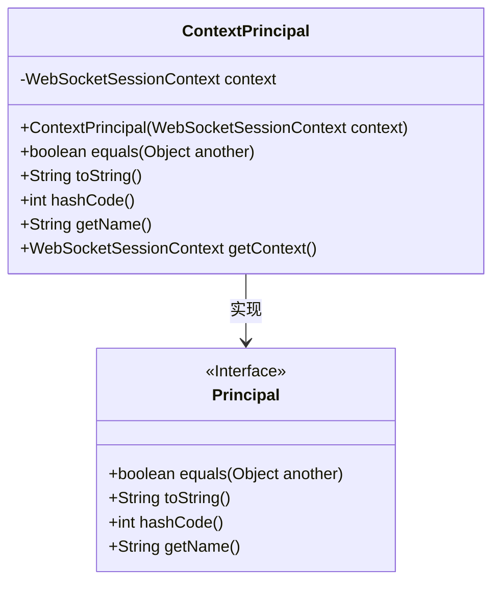
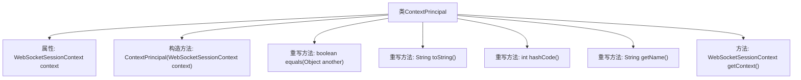

# 基础信息

|      |      |
|------|------|
| 名称 | ContextPrincipal |
| 编码语言 | .java |
| 代码路径 | Signal-Server/websocket-resources/src/main/java/org/whispersystems/websocket/session/ContextPrincipal.java |
| 包名 | org.whispersystems.websocket.session |
| 依赖项 | ['java.security.Principal'] |
| 概述说明 | ContextPrincipal类实现Principal接口，封装WebSocketSessionContext，提供常用方法。 |

# 说明

ContextPrincipal类实现了Principal接口，用于封装WebSocketSessionContext。该类提供了equals、hashCode和getName等关键方法，确保对象在比较、哈希计算和名称获取时的功能完整性。通过实现Principal接口，ContextPrincipal类能够有效管理WebSocket会话的上下文信息，并支持相关的身份验证和会话管理操作。

# 类列表 Class Summary

| 名称   | 类型  | 说明 |
|-------|------|-------------|
| ContextPrincipal | class | ContextPrincipal类实现Principal接口，封装WebSocketSessionContext，提供equals、hashCode、getName等方法。 |

## 类 ContextPrincipal

|      |      |
|------|------|
| 访问范围 | public |
| 类型 | class |
| 名称 | ContextPrincipal |
| 说明 | ContextPrincipal类实现Principal接口，封装WebSocketSessionContext，提供equals、hashCode、getName等方法。 |

### UML类图

类图描述：`ContextPrincipal`类实现了`Principal`接口，包含一个私有的`WebSocketSessionContext`对象，并提供了构造方法、`equals`、`toString`、`hashCode`、`getName`和`getContext`方法。`ContextPrincipal`通过`equals`方法比较两个`ContextPrincipal`对象的`context`属性，`hashCode`方法返回`context`的哈希值，`getName`方法返回固定字符串“WebSocketSessionContext”，`getContext`方法返回`context`对象。

### 内部方法调用关系图

**描述：**  
`ContextPrincipal`类实现了`Principal`接口，包含一个`WebSocketSessionContext`类型的属性`context`。该类通过构造方法初始化`context`，并重写了`equals`、`toString`、`hashCode`和`getName`方法，分别用于比较对象、返回字符串表示、生成哈希码和获取名称。此外，还提供了一个`getContext`方法用于返回`context`对象。

### 字段列表 Field List

| 名称  | 类型  | 说明 |
|-------|-------|------|
| context | WebSocketSessionContext | 私有不可变的WebSocket会话上下文对象。 |

### 方法列表 Method List

| 名称  | 类型  | 说明 |
|-------|-------|------|
| equals | boolean | 重写equals方法，检查对象是否为ContextPrincipal并比较context属性。 |
| getName | String | 重写getName方法，返回WebSocketSessionContext。 |
| toString | String | 重写toString方法，调用父类的toString方法。 |
| getContext | WebSocketSessionContext | 获取WebSocket会话上下文。 |
| hashCode | int | 重写hashCode方法，返回context的哈希值。 |

