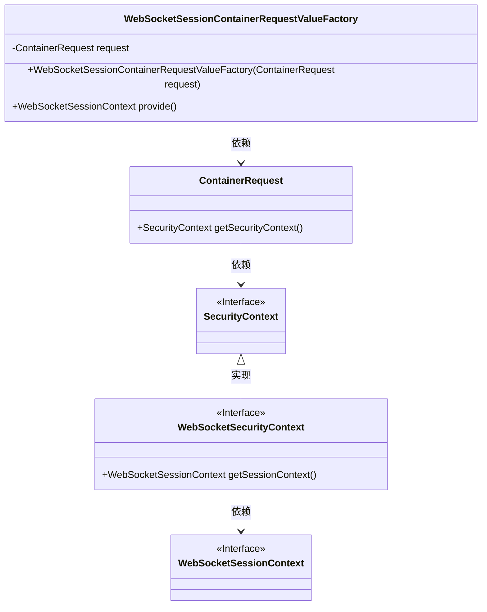
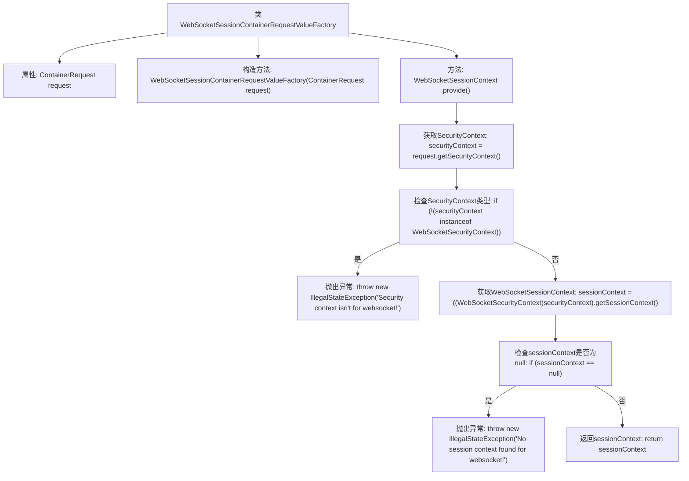

# 基础信息

|      |      |
|------|------|
| 名称 | WebSocketSessionContainerRequestValueFactory |
| 编码语言 | .java |
| 代码路径 | Signal-Server/websocket-resources/src/main/java/org/whispersystems/websocket/session/WebSocketSessionContainerRequestValueFactory.java |
| 包名 | org.whispersystems.websocket.session |
| 依赖项 | ['jakarta.ws.rs.core.SecurityContext', 'org.glassfish.jersey.server.ContainerRequest', 'org.whispersystems.websocket.WebSocketSecurityContext'] |
| 概述说明 | WebSocketSessionContainerRequestValueFactory类从ContainerRequest提取并验证WebSocketSessionContext。 |

# 说明

WebSocketSessionContainerRequestValueFactory类的主要功能是从ContainerRequest对象中提取WebSocketSessionContext，并进行安全性验证，最终返回会话上下文。该类的核心作用在于确保从请求中获取的WebSocket会话上下文是安全且有效的，以便后续处理和使用。

# 类列表 Class Summary

| 名称   | 类型  | 说明 |
|-------|------|-------------|
| WebSocketSessionContainerRequestValueFactory | class | WebSocketSessionContainerRequestValueFactory类用于从ContainerRequest中提取WebSocketSessionContext，验证安全性并返回会话上下文。 |

## 类 WebSocketSessionContainerRequestValueFactory

|      |      |
|------|------|
| 访问范围 | public |
| 类型 | class |
| 名称 | WebSocketSessionContainerRequestValueFactory |
| 说明 | WebSocketSessionContainerRequestValueFactory类用于从ContainerRequest中提取WebSocketSessionContext，验证安全性并返回会话上下文。 |

### UML类图

这段代码定义了一个`WebSocketSessionContainerRequestValueFactory`类，用于从`ContainerRequest`中提取`WebSocketSessionContext`。该类依赖于`ContainerRequest`来获取`SecurityContext`，并检查其是否为`WebSocketSecurityContext`类型。如果是，则进一步获取`WebSocketSessionContext`，否则抛出异常。类图展示了各个类之间的依赖关系和接口实现关系。

### 内部方法调用关系图

这段代码定义了一个名为 `WebSocketSessionContainerRequestValueFactory` 的类，用于创建 `WebSocketSessionContext` 对象。代码首先通过 `ContainerRequest` 对象获取 `SecurityContext`，然后检查该上下文是否为 `WebSocketSecurityContext` 类型。如果不是，则抛出异常。接着，代码尝试从 `WebSocketSecurityContext` 中获取 `WebSocketSessionContext`，如果获取到的 `sessionContext` 为 `null`，则抛出异常。最后，返回有效的 `sessionContext`。流程图清晰地展示了这一过程，包括条件判断和异常处理。

### 字段列表 Field List

| 名称  | 类型  | 说明 |
|-------|-------|------|
| request | ContainerRequest | 私有不可变的容器请求对象。 |

### 方法列表 Method List

| 名称  | 类型  | 说明 |
|-------|-------|------|
| provide | WebSocketSessionContext | 提供WebSocket会话上下文，验证安全上下文并返回有效会话。 |

