# 基础信息

|      |      |
|------|------|
| 名称 | WebSocketSessionContext |
| 编码语言 | .java |
| 代码路径 | Signal-Server/websocket-resources/src/main/java/org/whispersystems/websocket/session/WebSocketSessionContext.java |
| 包名 | org.whispersystems.websocket.session |
| 依赖项 | ['java.util.LinkedList', 'java.util.List', 'java.util.concurrent.locks.ReentrantLock', 'javax.annotation.Nullable', 'org.whispersystems.websocket.WebSocketClient'] |
| 概述说明 | WebSocket管理会话认证及关闭监听。 |

# 说明

WebSocket会话上下文管理涉及认证状态的维护和关闭监听器的设置。认证状态用于确保会话的安全性，而关闭监听器则用于在会话结束时执行相应的清理操作。这两者共同确保了WebSocket会话的稳定性和安全性。

# 类列表 Class Summary

| 名称   | 类型  | 说明 |
|-------|------|-------------|
| WebSocketSessionContext | class | WebSocket会话上下文管理认证状态和关闭监听器。 |


## 类 WebSocketSessionContext

|      |      |
|------|------|
| 访问范围 | public |
| 类型 | class |
| 名称 | WebSocketSessionContext |
| 说明 | WebSocket会话上下文管理认证状态和关闭监听器。 |


### UML类图

```mermaid
classDiagram
    class WebSocketSessionContext {
        -List~WebSocketEventListener~ closeListeners
        -ReentrantLock lock
        -WebSocketClient webSocketClient
        -Object authenticated
        -boolean closed
        +WebSocketSessionContext(WebSocketClient webSocketClient)
        +void setAuthenticated(Object authenticated)
        +~T~ getAuthenticated(Class~T~ clazz)
        +@Nullable Object getAuthenticated()
        +void addWebsocketClosedListener(WebSocketEventListener listener)
        +WebSocketClient getClient()
        +void notifyClosed(int statusCode, String reason)
        <<Interface>> WebSocketEventListener {
            +void onWebSocketClose(WebSocketSessionContext context, int statusCode, String reason)
        }
    }
    WebSocketSessionContext --> WebSocketEventListener : 依赖
```

类图描述：`WebSocketSessionContext` 类管理 WebSocket 会话的上下文信息，包括认证对象、关闭监听器和客户端实例。它通过 `ReentrantLock` 确保线程安全，并提供方法来设置和获取认证对象、添加关闭监听器以及通知会话关闭。`WebSocketEventListener` 是一个接口，定义了在 WebSocket 关闭时触发的回调方法。


### 内部方法调用关系图

```mermaid
graph TD
    A["类WebSocketSessionContext"]
    B["属性: List<WebSocketEventListener> closeListeners"]
    C["属性: ReentrantLock lock"]
    D["属性: WebSocketClient webSocketClient"]
    E["属性: Object authenticated"]
    F["属性: boolean closed"]
    G["构造方法: WebSocketSessionContext(WebSocketClient webSocketClient)"]
    H["方法: void setAuthenticated(Object authenticated)"]
    I["方法: <T> T getAuthenticated(Class<T> clazz)"]
    J["方法: @Nullable Object getAuthenticated()"]
    K["方法: void addWebsocketClosedListener(WebSocketEventListener listener)"]
    L["方法: WebSocketClient getClient()"]
    M["方法: void notifyClosed(int statusCode, String reason)"]
    N["接口: WebSocketEventListener"]
    O["方法: void onWebSocketClose(WebSocketSessionContext context, int statusCode, String reason)"]

    A --> B
    A --> C
    A --> D
    A --> E
    A --> F
    A --> G
    A --> H
    A --> I
    A --> J
    A --> K
    A --> L
    A --> M
    A -.-> N
    N --> O
```



这段代码定义了一个 `WebSocketSessionContext` 类，用于管理 WebSocket 会话的上下文信息。该类包含多个属性和方法，用于处理认证、关闭监听器的添加和通知等操作。`WebSocketEventListener` 接口定义了 `onWebSocketClose` 方法，用于在 WebSocket 关闭时执行特定操作。代码通过 `ReentrantLock` 确保线程安全，特别是在添加监听器和通知关闭时。

### 字段列表 Field List

| 名称  | 类型  | 说明 |
|-------|-------|------|
| authenticated | Object | 私有对象认证状态。 |
| closeListeners = new LinkedList<>() | List<WebSocketEventListener> | 私有链表存储WebSocket关闭事件监听器。 |
| lock = new ReentrantLock() | ReentrantLock | 使用ReentrantLock实现线程同步。 |
| webSocketClient | WebSocketClient | 私有不可变的WebSocket客户端实例。 |
| closed | boolean | 定义一个私有的布尔类型变量closed。 |

### 方法列表 Method List

| 名称  | 类型  | 说明 |
|-------|-------|------|
| setAuthenticated | void | 设置认证对象的方法。 |
| getClient | WebSocketClient | 获取WebSocket客户端实例。 |
| getAuthenticated | Object | 返回可空认证对象。 |
| getAuthenticated | T | 获取已验证对象，若类型匹配则返回，否则抛出异常。 |
| addWebsocketClosedListener | void | 为WebSocket添加关闭监听器，确保线程安全。 |
| notifyClosed | void | 方法通知关闭，锁定后遍历监听器并触发关闭事件，最后解锁。 |


