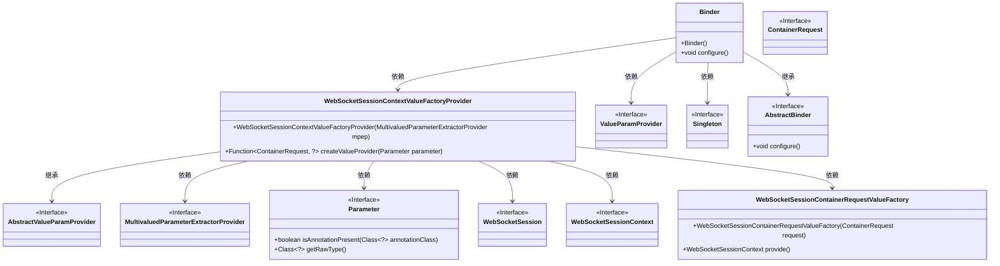
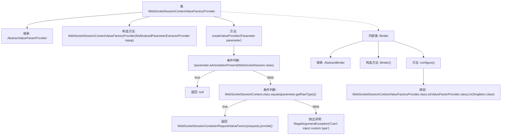

# 基础信息

|      |      |
|------|------|
| 名称 | WebSocketSessionContextValueFactoryProvider |
| 编码语言 | .java |
| 代码路径 | Signal-Server/websocket-resources/src/main/java/org/whispersystems/websocket/session/WebSocketSessionContextValueFactoryProvider.java |
| 包名 | org.whispersystems.websocket.session |
| 依赖项 | ['jakarta.inject.Inject', 'jakarta.inject.Singleton', 'java.util.function.Function', 'javax.annotation.Nullable', 'org.glassfish.jersey.internal.inject.AbstractBinder', 'org.glassfish.jersey.server.ContainerRequest', 'org.glassfish.jersey.server.internal.inject.AbstractValueParamProvider', 'org.glassfish.jersey.server.internal.inject.MultivaluedParameterExtractorProvider', 'org.glassfish.jersey.server.model.Parameter', 'org.glassfish.jersey.server.spi.internal.ValueParamProvider'] |
| 概述说明 | 单例类提供WebSocket会话上下文工厂，支持参数注入与类型检查。 |

# 说明

单例类设计用于提供WebSocket会话的上下文值工厂，确保全局唯一实例。该工厂支持参数注入，允许在创建实例时传递必要参数，同时具备类型检查功能，确保传入参数和返回值符合预期类型，提高代码的健壮性和可维护性。

# 类列表 Class Summary

| 名称   | 类型  | 说明 |
|-------|------|-------------|
| WebSocketSessionContextValueFactoryProvider | class | 单例类提供WebSocket会话上下文值工厂，支持参数注入与类型检查。 |

## 类 WebSocketSessionContextValueFactoryProvider

|      |      |
|------|------|
| 访问范围 | @Singleton;public |
| 类型 | class |
| 名称 | WebSocketSessionContextValueFactoryProvider |
| 说明 | 单例类提供WebSocket会话上下文值工厂，支持参数注入与类型检查。 |

### UML类图

这段代码描述了一个用于处理WebSocket会话上下文的工厂提供者类`WebSocketSessionContextValueFactoryProvider`，它继承自`AbstractValueParamProvider`，并通过`Binder`类进行绑定配置。`WebSocketSessionContextValueFactoryProvider`负责根据参数类型创建相应的值提供者，支持`WebSocketSessionContext`类型的注入，并在不符合条件时抛出异常。`Binder`类用于将`WebSocketSessionContextValueFactoryProvider`绑定到`ValueParamProvider`接口，并确保其为单例模式。

### 内部方法调用关系图

这段代码定义了一个`WebSocketSessionContextValueFactoryProvider`类，用于处理WebSocket会话上下文的注入。它继承自`AbstractValueParamProvider`，并通过`createValueProvider`方法根据参数类型和注解来决定返回的值工厂或抛出异常。内部类`Binder`用于绑定`WebSocketSessionContextValueFactoryProvider`到`ValueParamProvider`接口，并指定为单例模式。

### 字段列表 Field List

| 名称  | 类型  | 说明 |
|-------|-------|------|

### 方法列表 Method List

| 名称  | 类型  | 说明 |
|-------|-------|------|
| createValueProvider | Function<ContainerRequest, ?> | 根据参数类型创建WebSocket会话值提供者，否则抛出异常。 |

