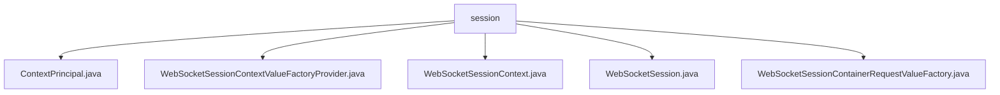

# 基础信息

|      |      |
|------|------|
| 名称 | session |
| 编码语言 | .java |
| 代码路径 | Signal-Server/websocket-resources/src/main/java/org/whispersystems/websocket/session |
| 包名 | Signal-Server.websocket-resources.src.main.java.org.whispersystems.websocket.session |
| 概述说明 | ContextPrincipal类管理WebSocket会话，支持身份验证和会话管理。 |

# 说明

## 概述
该代码模块主要围绕WebSocket会话的管理和上下文处理展开，涵盖了会话上下文的封装、认证状态的维护、会话关闭的监听以及会话上下文的提取与验证等功能。通过实现`Principal`接口和使用单例设计模式，模块确保了会话管理的安全性和全局唯一性，同时通过类型检查和参数注入提高了代码的健壮性和可维护性。

## 主要业务场景
1. **WebSocket会话上下文管理**：通过`ContextPrincipal`类封装WebSocket会话上下文，支持身份验证和会话管理操作，确保会话信息的完整性和安全性。
2. **会话上下文的提取与验证**：`WebSocketSessionContainerRequestValueFactory`类从`ContainerRequest`对象中提取并验证WebSocket会话上下文，确保会话的安全性和有效性。
3. **会话状态的维护与清理**：`WebSocketSessionContext`类负责维护WebSocket会话的认证状态，并设置关闭监听器，确保会话结束时执行必要的清理操作。
4. **全局唯一的会话上下文值工厂**：`WebSocketSessionContextValueFactoryProvider`类采用单例设计模式，提供全局唯一的会话上下文值工厂，支持参数注入和类型检查，确保代码的健壮性和可维护性。

该模块的核心目标是确保WebSocket会话的安全性、稳定性和高效管理，适用于需要处理WebSocket会话的复杂应用场景。

### 包内部结构视图

该流程图展示了`session`文件夹下的文件层级关系。`session`作为根节点，包含了五个子节点，分别是`ContextPrincipal.java`、`WebSocketSessionContextValueFactoryProvider.java`、`WebSocketSessionContext.java`、`WebSocketSession.java`和`WebSocketSessionContainerRequestValueFactory.java`。这些文件都位于`session`目录下，且没有进一步的子目录结构。

# 文件列表 File List

| 名称   | 类型  | 说明 |
|-------|------|-------------|
| [WebSocketSessionContextValueFactoryProvider.java](WebSocketSessionContextValueFactoryProvider.md) | file | 单例类提供WebSocket会话上下文工厂，支持参数注入与类型检查。 |
| [WebSocketSessionContainerRequestValueFactory.java](WebSocketSessionContainerRequestValueFactory.md) | file | WebSocketSessionContainerRequestValueFactory类从ContainerRequest提取并验证WebSocketSessionContext。 |
| [WebSocketSession.java](WebSocketSession.md) | file | 信息为空，无法生成概要描述。 |
| [WebSocketSessionContext.java](WebSocketSessionContext.md) | file | WebSocket管理会话认证及关闭监听。 |
| [ContextPrincipal.java](ContextPrincipal.md) | file | ContextPrincipal类实现Principal接口，封装WebSocketSessionContext，提供常用方法。 |

