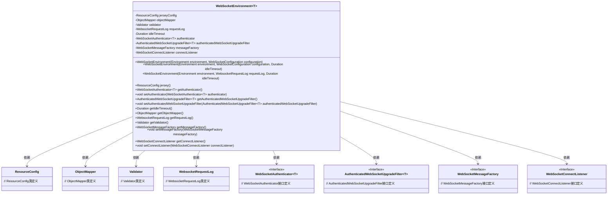

# 基础信息

|      |      |
|------|------|
| 名称 | WebSocketEnvironment |
| 编码语言 | .java |
| 代码路径 | Signal-Server/websocket-resources/src/main/java/org/whispersystems/websocket/setup/WebSocketEnvironment.java |
| 包名 | org.whispersystems.websocket.setup |
| 依赖项 | ['com.fasterxml.jackson.databind.ObjectMapper', 'io.dropwizard.core.setup.Environment', 'io.dropwizard.jersey.DropwizardResourceConfig', 'jakarta.validation.Validator', 'java.security.Principal', 'java.time.Duration', 'org.glassfish.jersey.server.ResourceConfig', 'org.whispersystems.websocket.auth.AuthenticatedWebSocketUpgradeFilter', 'org.whispersystems.websocket.auth.WebSocketAuthenticator', 'org.whispersystems.websocket.configuration.WebSocketConfiguration', 'org.whispersystems.websocket.logging.WebsocketRequestLog', 'org.whispersystems.websocket.messages.WebSocketMessageFactory', 'org.whispersystems.websocket.messages.protobuf.ProtobufWebSocketMessageFactory', 'javax.annotation.Nullable'] |
| 概述说明 | WebSocketEnvironment类配置WebSocket环境，支持认证、日志、消息工厂及自定义超时和连接监听。 |

# 说明

WebSocketEnvironment类用于配置WebSocket环境，包含认证、日志、消息工厂等组件，支持自定义超时和连接监听功能。该类提供了灵活的环境设置，能够根据需求调整各个组件的配置，确保WebSocket连接的稳定性和安全性。通过该类，用户可以方便地管理认证机制、日志记录、消息处理以及连接状态，满足不同场景下的需求。

# 类列表 Class Summary

| 名称   | 类型  | 说明 |
|-------|------|-------------|
| WebSocketEnvironment | class | WebSocketEnvironment类用于配置WebSocket环境，包含认证、日志、消息工厂等组件，支持自定义超时和连接监听。 |

## 类 WebSocketEnvironment

|      |      |
|------|------|
| 访问范围 | public |
| 类型 | class |
| 名称 | WebSocketEnvironment |
| 说明 | WebSocketEnvironment类用于配置WebSocket环境，包含认证、日志、消息工厂等组件，支持自定义超时和连接监听。 |

### UML类图

类图描述：`WebSocketEnvironment` 类是一个泛型类，依赖于多个接口和类，包括 `ResourceConfig`、`ObjectMapper`、`Validator`、`WebsocketRequestLog` 等。它提供了多个构造函数和 getter/setter 方法，用于管理和配置 WebSocket 环境。通过类图可以清晰地看到 `WebSocketEnvironment` 类与其他类之间的依赖关系，以及它如何通过接口与具体的实现类进行交互。

### 内部方法调用关系图

```mermaid
graph TD
    A["类WebSocketEnvironment<T extends Principal>"]
    B["属性: ResourceConfig jerseyConfig"]
    C["属性: ObjectMapper objectMapper"]
    D["属性: Validator validator"]
    E["属性: WebsocketRequestLog requestLog"]
    F["属性: Duration idleTimeout"]
    G["属性: WebSocketAuthenticator<T> authenticator"]
    H["属性: AuthenticatedWebSocketUpgradeFilter<T> authenticatedWebSocketUpgradeFilter"]
    I["属性: WebSocketMessageFactory messageFactory"]
    J["属性: WebSocketConnectListener connectListener"]
    K["构造方法: WebSocketEnvironment(Environment environment, WebSocketConfiguration configuration)"]
    L["构造方法: WebSocketEnvironment(Environment environment, WebSocketConfiguration configuration, Duration idleTimeout)"]
    M["构造方法: WebSocketEnvironment(Environment environment, WebsocketRequestLog requestLog, Duration idleTimeout)"]
    N["方法: ResourceConfig jersey()"]
    O["方法: WebSocketAuthenticator<T> getAuthenticator()"]
    P["方法: void setAuthenticator(WebSocketAuthenticator<T> authenticator)"]
    Q["方法: AuthenticatedWebSocketUpgradeFilter<T> getAuthenticatedWebSocketUpgradeFilter()"]
    R["方法: void setAuthenticatedWebSocketUpgradeFilter(AuthenticatedWebSocketUpgradeFilter<T> authenticatedWebSocketUpgradeFilter)"]
    S["方法: Duration getIdleTimeout()"]
    T["方法: ObjectMapper getObjectMapper()"]
    U["方法: WebsocketRequestLog getRequestLog()"]
    V["方法: Validator getValidator()"]
    W["方法: WebSocketMessageFactory getMessageFactory()"]
    X["方法: void setMessageFactory(WebSocketMessageFactory messageFactory)"]
    Y["方法: WebSocketConnectListener getConnectListener()"]
    Z["方法: void setConnectListener(WebSocketConnectListener connectListener)"]

    A --> B
    A --> C
    A --> D
    A --> E
    A --> F
    A --> G
    A --> H
    A --> I
    A --> J
    A --> K
    K --> L
    L --> M
    A --> N
    A --> O
    A --> P
    A --> Q
    A --> R
    A --> S
    A --> T
    A --> U
    A --> V
    A --> W
    A --> X
    A --> Y
    A --> Z
```

该流程图展示了`WebSocketEnvironment`类的结构和内部方法调用关系。类中包含多个属性和构造方法，用于初始化WebSocket环境的不同组件。此外，类还提供了多个getter和setter方法，用于访问和修改这些属性。流程图清晰地展示了类中各个部分之间的依赖关系，帮助理解类的整体设计和工作原理。

### 字段列表 Field List

| 名称  | 类型  | 说明 |
|-------|-------|------|
| authenticator | WebSocketAuthenticator<T> | 私有WebSocket认证器实例。 |
| authenticatedWebSocketUpgradeFilter | AuthenticatedWebSocketUpgradeFilter<T> | 私有认证WebSocket升级过滤器变量声明。 |
| jerseyConfig | ResourceConfig | 私有且不可变的Jersey资源配置实例。 |
| connectListener | WebSocketConnectListener | 私有WebSocket连接监听器变量connectListener。 |
| requestLog | WebsocketRequestLog | 私有且不可变的Websocket请求日志对象。 |
| objectMapper | ObjectMapper | 私有且不可变的ObjectMapper实例。 |
| messageFactory | WebSocketMessageFactory | 私有WebSocket消息工厂实例。 |
| idleTimeout | Duration | 私有常量 idleTimeout 定义超时时间。 |
| validator | Validator | 私有且不可变的验证器实例。 |

### 方法列表 Method List

| 名称  | 类型  | 说明 |
|-------|-------|------|
| setAuthenticatedWebSocketUpgradeFilter | void | 设置认证WebSocket升级过滤器实例。 |
| getMessageFactory | WebSocketMessageFactory | 获取WebSocket消息工厂实例的方法。 |
| setConnectListener | void | 设置WebSocket连接监听器的方法。 |
| getAuthenticatedWebSocketUpgradeFilter | AuthenticatedWebSocketUpgradeFilter<T> | 返回可空的已验证WebSocket升级过滤器实例。 |
| getConnectListener | WebSocketConnectListener | 获取WebSocket连接监听器的方法。 |
| getIdleTimeout | Duration | 该方法返回空闲超时时间。 |
| getAuthenticator | WebSocketAuthenticator<T> | 方法返回可空的WebSocketAuthenticator对象。 |
| getRequestLog | WebsocketRequestLog | 获取Websocket请求日志的方法。 |
| setMessageFactory | void | 设置WebSocket消息工厂方法。 |
| getObjectMapper | ObjectMapper | 该方法返回一个ObjectMapper对象。 |
| jersey | ResourceConfig | 该方法返回jerseyConfig资源配置实例。 |
| setAuthenticator | void | 设置WebSocket认证器方法，用于指定认证器实例。 |
| getValidator | Validator | 该方法返回一个验证器对象。 |

