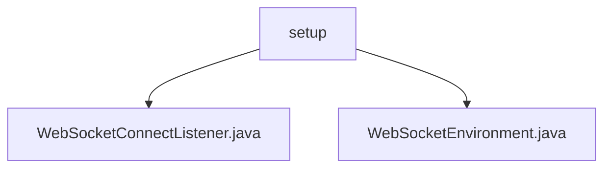

# 基础信息

|      |      |
|------|------|
| 名称 | setup |
| 编码语言 | .java |
| 代码路径 | Signal-Server/websocket-resources/src/main/java/org/whispersystems/websocket/setup |
| 包名 | Signal-Server.websocket-resources.src.main.java.org.whispersystems.websocket.setup |
| 概述说明 | WebSocketEnvironment类配置WebSocket环境，支持认证、日志、消息处理及自定义超时和连接监听。 |

# 说明

## 概述
该代码模块主要围绕WebSocket连接的配置和管理展开，提供了灵活的环境设置和连接监听功能。通过`WebSocketEnvironment`类，用户可以配置认证、日志、消息工厂等组件，并支持自定义超时和连接监听。`WebSocketConnectListener`类则用于监听WebSocket连接事件，确保连接的稳定性和安全性。

## 主要业务场景
1. **WebSocket环境配置**：通过`WebSocketEnvironment`类，用户可以根据需求灵活配置WebSocket连接的各个组件，包括认证机制、日志记录、消息处理等，确保连接的安全性和稳定性。
2. **连接监听与管理**：`WebSocketConnectListener`类用于监听WebSocket连接事件，用户可以通过自定义连接监听功能，实时监控连接状态，并根据需要进行调整。
3. **自定义超时设置**：该模块支持自定义超时设置，用户可以根据实际业务需求调整连接的超时时间，避免因网络问题导致的连接中断。
4. **消息处理与日志记录**：通过配置消息工厂和日志组件，用户可以方便地处理WebSocket消息，并记录相关日志，便于后续的调试和分析。

### 包内部结构视图

该流程图展示了Signal-Server项目中websocket-resources模块的路径结构。`setup`文件夹下包含两个Java文件：`WebSocketConnectListener.java`和`WebSocketEnvironment.java`，分别用于处理WebSocket连接监听和环境配置。

# 文件列表 File List

| 名称   | 类型  | 说明 |
|-------|------|-------------|
| [WebSocketEnvironment.java](WebSocketEnvironment.md) | file | WebSocketEnvironment类配置WebSocket环境，支持认证、日志、消息工厂及自定义超时和连接监听。 |
| [WebSocketConnectListener.java](WebSocketConnectListener.md) | file | 信息为空，无法生成概要描述。 |

